### 금융 상품 비교 애플리케이션
# UMPA

### 목차
1. 구현 기능
2. 기술 스택
3. 업무 분담 내역
4. ERD, 컴포넌트 구성
5. 기능별 설명
6. 금융 상품 추천 알고리즘

## 구현 기능
1. 메인 페이지
2. 회원 커스터마이징
3. 예적금 금리 비교
4. 환율 계산기
5. 근처 은행 검색
6. 커뮤니티 (게시판)
7. 프로필 페이지
8. 금융 상품 추천 알고리즘
9. 추천 AI

## 기술 스택
### **front**
- language
    - javascript
- framework & library
    - Vue3
    - pinia (+pinia-plugin-persistedstate)
    - vuetify
    - axios
    - chart.js
    - AOS
### **back**
- language
    - python
- framework & library
    - django
    - django-rest-framework
    - dj-rest-auth
    - pillow
    - drf-spectacular
    - django-faker
    - ...

## 업무 분담 내역
|이름|역할 및 구현 기능|
|---|---|
|조성빈 |Front End : Front Component 구성, 컴포넌트 구성, 디자인, css, 메인 페이지, 금융 상품 페이지, 환율 계산기 페이지, 페이지네이션   Back End: ERD, 금융 상품 데이터 관리, 금융 데이터 정렬, 검색, 상세 조회 기능, 금융 추천 알고리즘, 금융 추천 AI, 환율 데이터 관리, 유저 1만 더미 데이터 생성 및 상품 가입 정보 추가|
|서준호|Front End  : 회원 관리 페이지, 커뮤니티 페이지, 주변 은행 검색 페이지, css   Back End : 회원 커스터마이징 - 유저 모델 커스텀, 회원가입, 로그인, 로그아웃, 회원 정보 조회 / 커뮤니티 - 게시글 CRUD, 게시글에 대한 댓글 CRUD, 게시글 좋아요(추천) |

## ERD, 컴포넌트 구성
### ERD
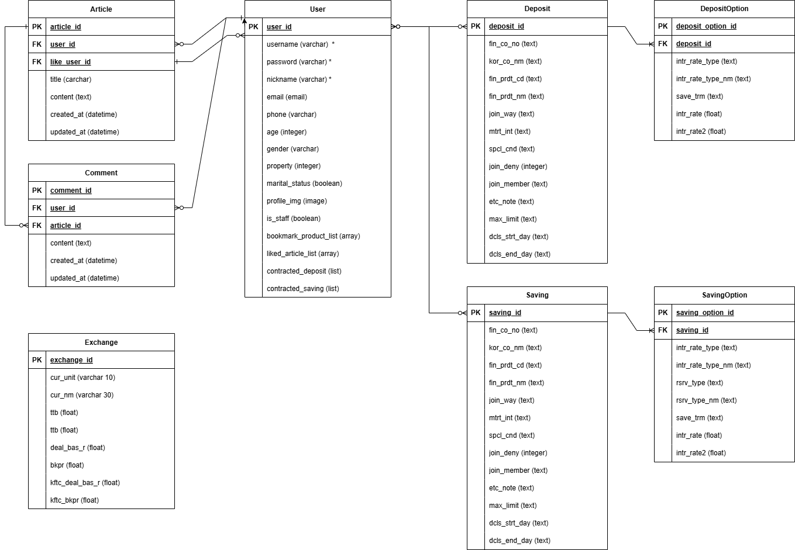  

### Component  
  

## 기능별 설명
1. 메인 페이지
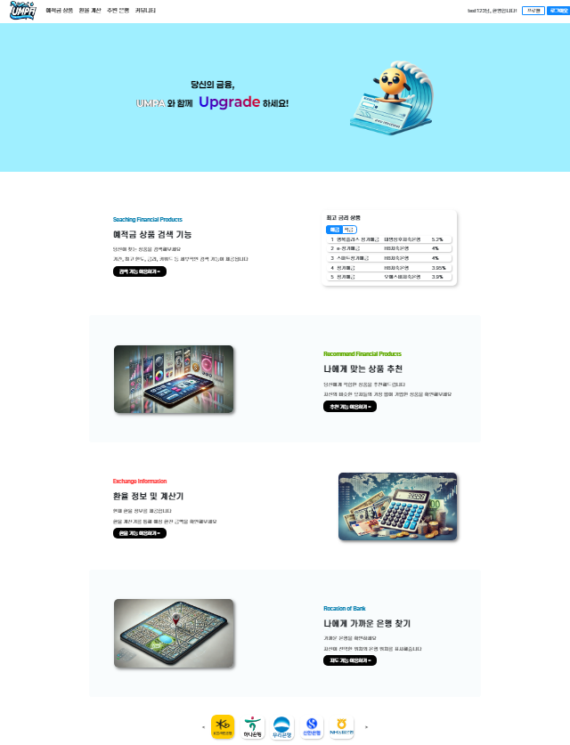  
- 기능들에 대한 대략적인 설명 및 링크 제공

2. 회원 커스터마이징
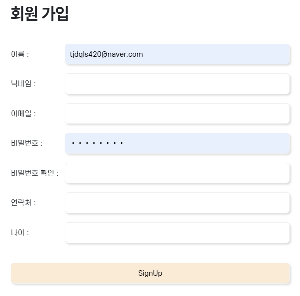
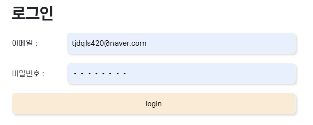

3. 예적금 금리 비교
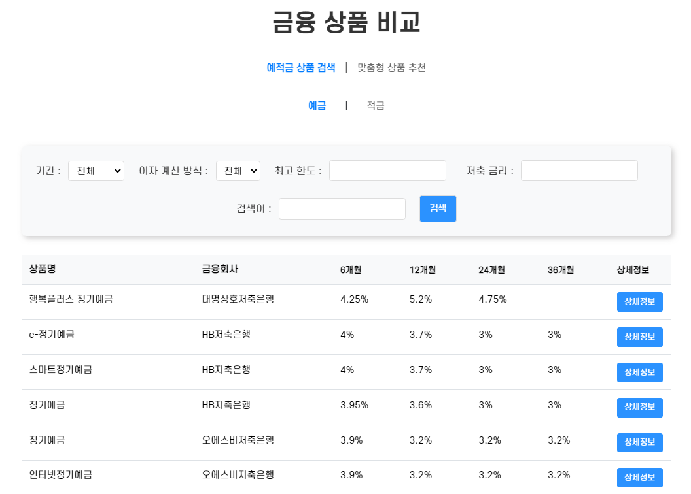

4. 환율 계산기
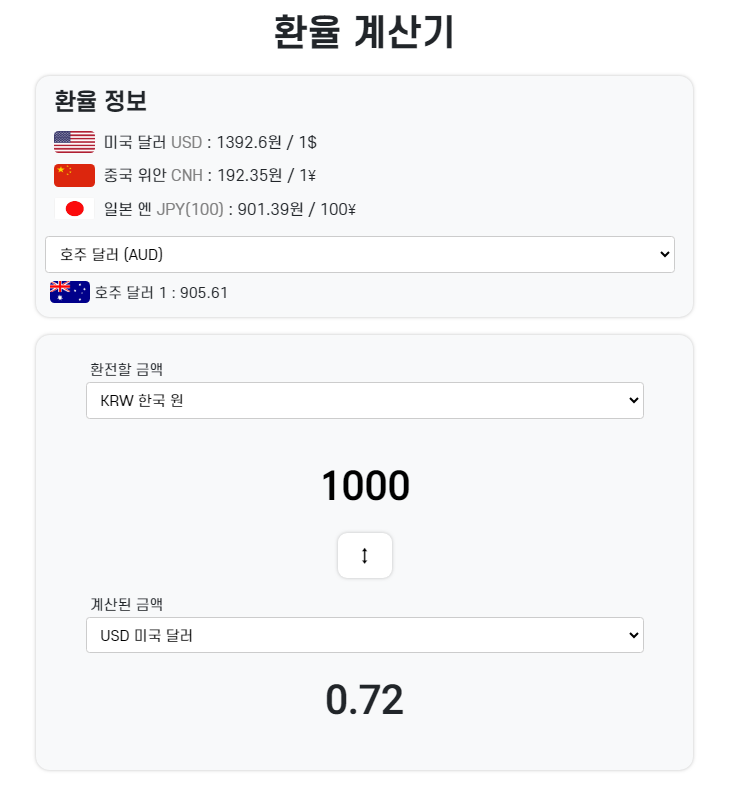

5. 근처 은행 검색
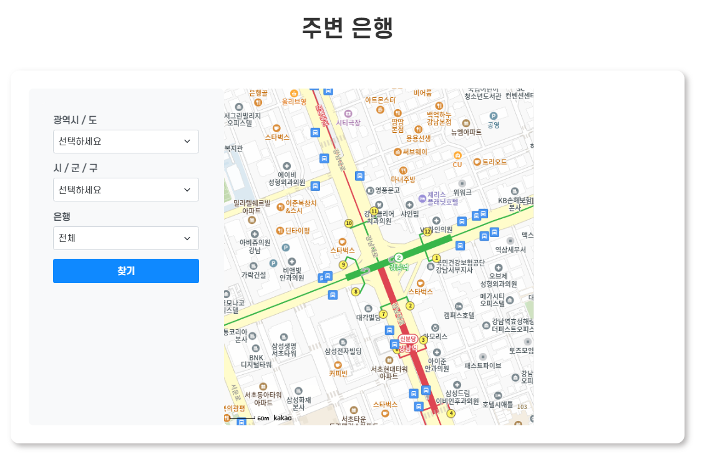

6. 커뮤니티 (게시판)
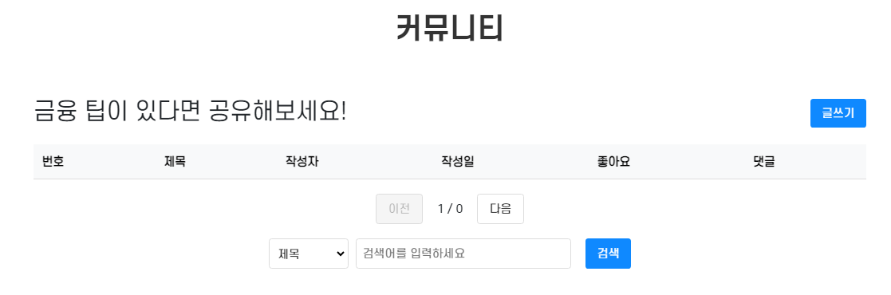

7. 프로필 페이지
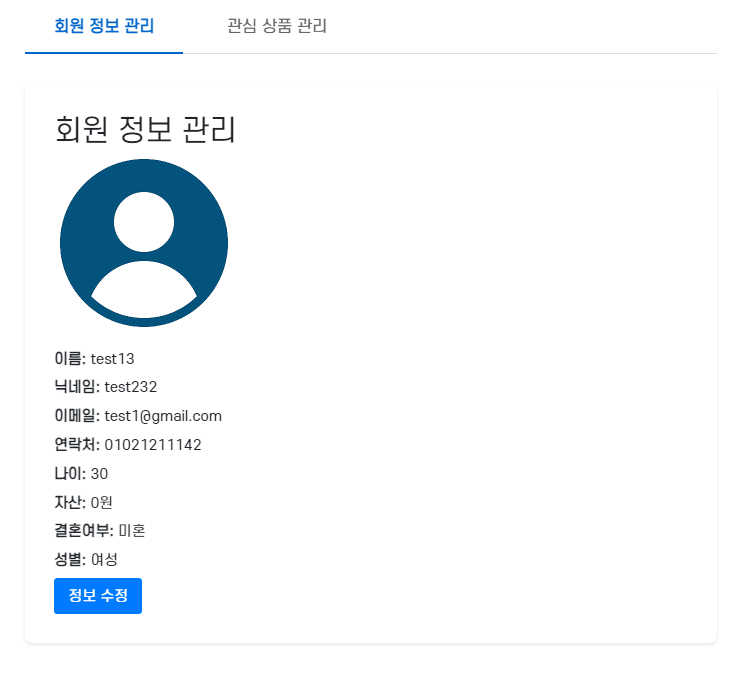
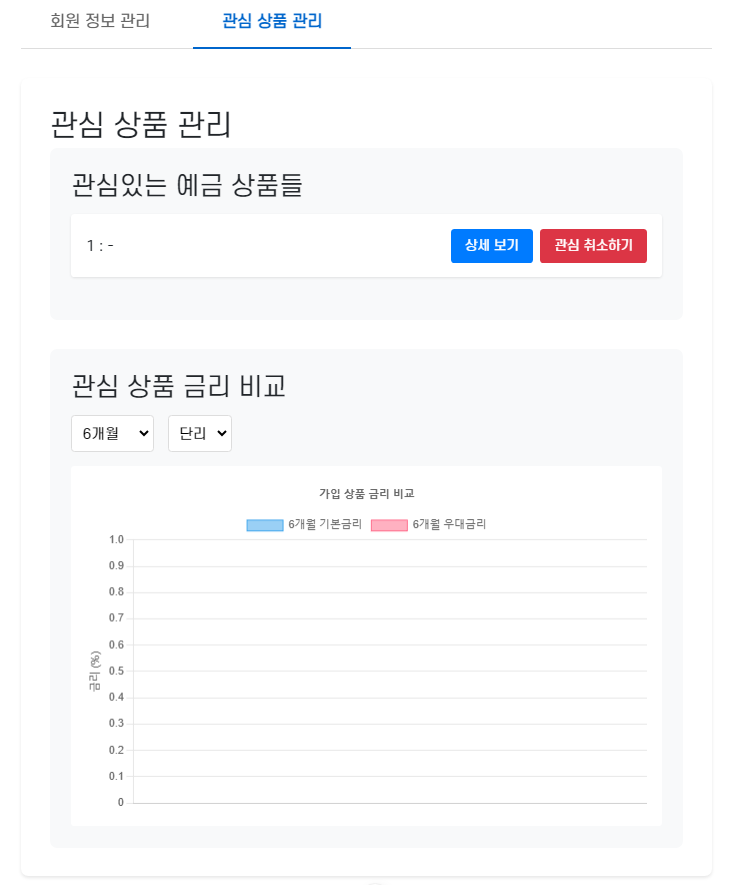

8. 금융 상품 추천 알고리즘
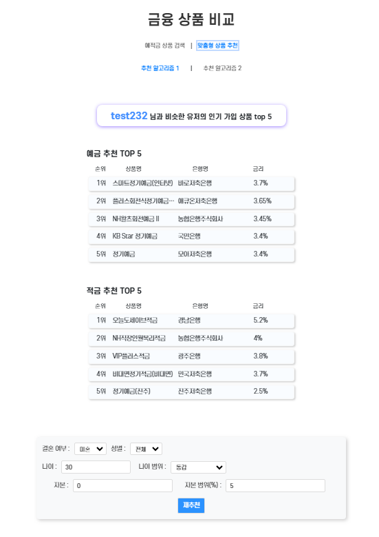

9. 추천 AI
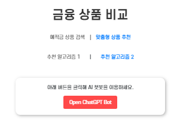
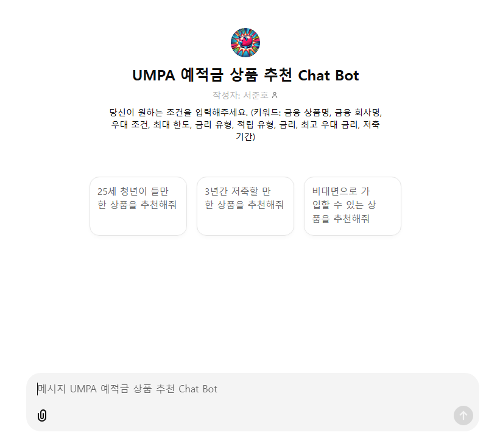

## 금융 상품 추천 알고리즘
1. 나와 비슷한 유저가 가입한 상품 추천
- 유저 더미데이터 1만명 생성
- 1만명 유저에 대한 상품 가입 정보 생성(연결)
- 개인 유저 정보를 기반으로 비슷한 상황의 유저 추출
- 가장 인기있는 상품 10개 추천 (예적금 각 5개)

2. 추천 AI
- 예금 적금 데이터를 학습시킴
- 텍스트로 뭉쳐져있는 데이터를 풀어서 설명하고 예상 질문 등 학습 심도를 높힘
- 유저의 질문 기반으로 상품 추천
