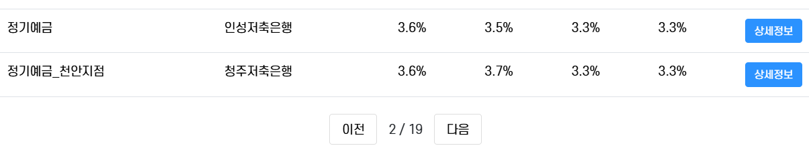

### 금융 상품 비교 애플리케이션
# UMPA

### 목차
1. 구현 기능
2. 기술 스택
3. 업무 분담 내역
4. ERD, 컴포넌트 구성
5. 기능별 설명
6. 금융 상품 추천 알고리즘

## 구현 기능
1. 메인 페이지
2. 회원 커스터마이징
3. 예적금 금리 비교
4. 환율 계산기
5. 근처 은행 검색
6. 커뮤니티 (게시판)
7. 프로필 페이지
8. 금융 상품 추천 알고리즘
9. 추천 AI

## 기술 스택
### **front**
- language
    - javascript
- framework & library
    - Vue3
    - pinia (+pinia-plugin-persistedstate)
    - vuetify
    - axios
    - chart.js
    - AOS
### **back**
- language
    - python
- framework & library
    - django
    - django-rest-framework
    - dj-rest-auth
    - pillow
    - drf-spectacular
    - django-faker
    - ...

## 업무 분담 내역
|이름|역할 및 구현 기능|
|---|---|
|조성빈 |Front End : Front Component 구성, 디자인, css, 메인 페이지, 금융 상품 페이지, 환율 계산기 페이지, 페이지네이션   Back End: ERD, 금융 상품 데이터 관리, 금융 데이터 정렬, 검색, 상세 조회 기능, 금융 추천 알고리즘, 금융 추천 AI, 환율 데이터 관리, 유저 1만 더미 데이터 생성 및 상품 가입 정보 추가|
|서준호|Front End  : 회원 관리 페이지, 커뮤니티 페이지, 주변 은행 검색 페이지, css   Back End : 회원 커스터마이징 - 유저 모델 커스텀, 회원가입, 로그인, 로그아웃, 회원 정보 조회 / 커뮤니티 - 게시글 CRUD, 게시글에 대한 댓글 CRUD, 게시글 좋아요(추천) |

## ERD, 컴포넌트 구성
### ERD
  

### Component  
  

## 기능별 설명
### 1. 메인 페이지
  
- 서비스의 메인 페이지입니다.
- "Upgrade My Personal FInance" 나의 금융을 업그레이드한다는 의미로 FI를 붙이면 A가되어 UMPA입니다!
- AI로 서비스에 어울리는 로고와 캐릭터, 설명 사진을 만들었습니다.
- 아래로 서비스의 기능들에 대한 대표 설명과 링크를 넣었습니다.
- 맨 아래에는 5대 은행으로 바로 이동할 수 있는 배너를 넣었습니다.

### 2. 회원 커스터마이징

- 기본 회원가입 및 로그인 기능입니다.

### 3. 예적금 금리 비교

- 예적금 상품들의 정보를 검색할 수 있습니다.
- 상품의 기간, 이자 방식, 상품 한도, 금리, 검색어를 통해 검색할 수 있습니다.

- 페이지네이션을 적용하여 페이지당 15개의 상품을 표시합니다.

### 4. 맞춤형 상품 추천

1. 나와 비슷한 유저가 가입한 상품 추천
    - 유저 더미데이터 1만명 생성
    - 1만명 유저에 대한 상품 가입 정보 생성(연결)
    - 나의 개인 정보를 기반으로 비슷한 상황의 유저 추출
    - 가장 인기있는 상품 10개 추천 (예적금 각 5개)

2. 추천 AI
    - chat gpt 나만의 gpt 기능을 사용해봤습니다.
    - 예금 적금 데이터를 학습
    - 텍스트로 뭉쳐져있는 데이터를 풀어서 설명하고 예상 질문 등 학습 심도를 높힘
    - 유저의 질문 기반으로 상품 검색해서 추천

### 5. 환율 계산기

- 23개국의 환율 정보
- 위에 대표적인 3국의 환율 정보를 고정으로 표시
- 국가 선택시 해당 국가에 대한 원화의 가치 비율 표시
- 아래에 숫자를 클릭(이미지에서는 기본 1000)하면 입력가능
- 화살표 표시 클릭 시 국가 및 금액 스위칭

### 6. 근처 은행 검색

- 찾을 위치와 은행을 선택해 해당 위치의 은행 표시

### 7. 커뮤니티 (게시판)

- 의견을 나눌 간단한 커뮤니티 기능

### 8. 프로필 페이지

- 내 정보 관리 페이지
- 자신의 프로필 이미지 등록 가능

### 9. 관심 상품 관리 (향후 개발)

- 찜한 상품에 대한 목록 저장 가능
- 내가 가입한 상품(정보에 입력된)과 찜한 상품의 금리를 비교해주는 기능

## 프로젝트를 마무리하며
### 조성빈
처음 진행하는 프로젝트여서 많이 미숙했지만 하나하나 페이지를 구현해나가는게 아주 즐거웠습니다. 기능이 하나씩 추가될 때마다 뿌듯하달까! 심플하지만 귀여운 로고와 캐릭터 그리고 깔끔한 디자인이 맘에 듭니다.  
아무래도 처음 진행하는 프로젝트이다보니 팀원과의 소통이 많이 부족했습니다. 팀원이 회원 기능의 OAuth 구현에 막혀있다는 것을 알았지만 같이 배운다고 생각했기에 최대한 시간을 주었지만 회원 기능이 없다보니 다른 기능들과의 연결이 연기되어 개발 속도가 확연히 느려졌습니다. mpv를 나눠 일단 간단한 회원 기능을 만들고 2차로 OAuth 기능으로 발전하는 계획을 짰더라면 둘 모두에게 좋았을 것 같습니다. 사실 역할을 명확히 나눈 것도 문서정리도 부족했습니다. 서로의 진행상황을 공유하며 개발계획도 수정해나가야한다는 점도 배웠습니다. 정말 많이 배운 첫 프로젝트였습니다.
